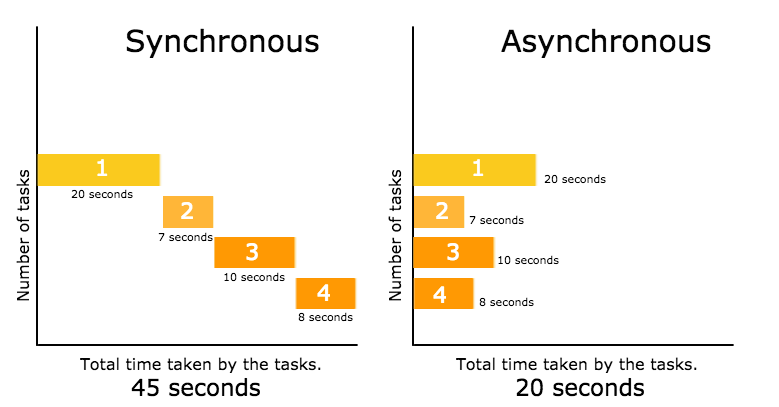

# [JS] AJAX란?

## AJAX(Asynchronous Javascript and Xml)란?

- Javascript의 라이브러리 중 하나이며 Asynchronous Javascript and Xml의 약자이다.
- JavaScript를 이용한 비동기식 통신이고, 클라이언트와 서버간에 XML 데이터를 비동기 방식으로 주고 받는 기술이다.
- 웹 서버에서 받아온 값을 Javascript로 변수로 저장한다.
- 기본적으로 http 프로토콜은 화면의 내용을 갱신하기 위해서는 다시 request를 하고 response를 하면서 페이지 전체를 갱신한다. 그래서 엄청난 자원 낭비와 시간 낭비를 초래한다. 하지만 AJAX는 브라우저가 가지고 있는 XMLHttpRequest 객체를 이용해서 전체 페이지를 새로 고치지 않고 페이지의 일부만을 로드하는 기법이다. 이 때, JSON이나 XML 형태로 필요한 데이터만 받아 갱신하기 때문에 그만큼의 자원과 시간을 아낄 수 있다.
- AJAX 기술은 여러가지 기술이 혼합적으로 사용되어 이루어지는데 대표적인 예로는 HTML, DOM, Javascript, XMLHttpRequest 등이 있다.
- AJAX는 네트워크 기술을 이용하여 클라이언트에서 서버로 데이터를 요청하고 그에 대한 결과를 돌려받을 수 있다. 즉, 서버와 클라이언트와의 통신이다.
  - 클라이언트란 서버에서 정보를 가져와서 사용자에게 보여줄 수 있고 사용자와 상호작용할 수 있는 소프트웨어를 말한다.
  - 서버란 네트워크 상에서 접근할 수 있는 프로그램으로서 어떤 자료들에 대한 관리나 접근을 제어해주는 프로그램이다.

<div align="center" style="margin-bottom: 2rem;">
  
</div>

<br>

## 비동기 방식이란?

비동기 방식은 웹페이지를 리로드하지 않고 데이터를 불러오는 방식이며 ajax를 통해서 서버에 요청을 한 후 멈추어 있는 것이 아니라 그 프로그램은 계속 돌아간다는 의미이다.

페이지 리로드의 경우 전체 리소스를 다시 불러와야 하는데 이미지, 스크립트, 기타 코드 등을 모두 재요청할 경우 불필요한 리소스 낭비가 발생하게 되지만 비동기식 방식을 이용할 경우 필요한 부분만 불러와 사용할 수 있으므로 매우 큰 장점이 있다.

<https://99geo.tistory.com/64>

<br>

## AJAX | 장단점

- 장점
  - 웹페이지의 속도 향상
  - 서버의 처리가 완료될 때까지 기다리지 않고 처리가 가능하다.
  - 서버에서 Data만 전송하면 되므로 전체적인 코딩의 양이 줄어든다.
  - 기존 웹에서는 불가능했던 다양한 UI를 가능하게 해준다.
- 단점
  - 히스토리 관리가 되지 않는다.
  - 페이지 이동없는 통신으로 인한 보안상의 문제가 있다.
  - 연속으로 데이터를 요청하면 서버 부하가 증가할 수 있다.
  - XTTPHttpRequest를 통해 통신하는 경우, 사용자에게 아무런 진행 정보가 주어지지 않는다. (요청이 완료되지 않았는데 사용자가 페이지를 떠나거나 오작동할 경우가 발생한다.)
  - AJAX를 쓸 수 없는 브라우저에 대한 문제 이슈가 있다.
  - HTTP 클라이언트의 기능이 한정된다.
  - 지원하는 Charset이 한정된다.
  - Script로 작성되므로 디버깅이 용이하지 않다.
  - 동일, 출처 정책으로 인하여 다른 도메인과는 통신이 불가능하다.

<br>

## AJAX | 진행 과정

1. 브라우저는 XMLHttpRequest Object를 만들어 서버에 정보를 request한다.
   - 이것을 위해서 필요한 method를 갖춘 object가 필요함
2. 서버에서 response가 왔을 때 callback 함수를 실행시킨다.
3. 브라우저는 콘텐츠를 처리하여 페이지에 추가한다.

<br>

## AJAX | axios vs fetch

- axios
  - 구형 브라우저를 지원한다.
  - 응답 시간 초과를 설정하는 방법이 있다.
  - JSON 데이터 자동 변환이 가능하다.
  - node.js.에서 사용이 가능하다.
  - request aborting(요청 취소)가 가능하다.
  - catch에 걸렸을 때, .then을 실행하지 않고, console 창에 해당 에러 로그를 보여준다.
  - return 값은 Promise 객체 형태이다.
- fetch
  - JavaScript의 내장 라이브러리이기 때문에 import를 하지 않고 사용할 수 있다.
  - 라이브러리의 업데이트에 따른 에러 방지가 가능하다. (React Native의 경우 업데이트가 잦아서 라이브러리가 쫒아오지 못하는 경우가 많은데, fetch의 경우 이를 방지할 수 있다.)
  - 네트워크 에러가 발생했을 때 기다려야 한다. (response timeout API 제공하지 않는다.)
  - 지원하지 않는 브라우저가 잇다.
  - return 값은 Promise 객체 형태이다.

```javascript
// axios 예제
async function test() {
  await axios({
    method: "get",
    url: `https://api.testUrl`,
  })
    .then(function (response) {
      console.log("성공", response);
    })
    .catch(function (error) {
      console.log("실패", error);
    });
}

// fetch 예제
fetch(url, options)
  .then((response) => console.log("response:", response))
  .catch((error) => console.log("error:", error));
```

<br>

## AJAX | 예제

AJAX의 대표적인 예제로 jQuery를 통한 Ajax가 있다.

```javascript
$.ajax({
  // URL은 필수 요소이므로 반드시 구현해야 하는 Property입니다.
  url: 'url', // 요청이 전송될 URL 주소
  type: 'GET', // http 요청 방식 (default: ‘GET’)
  async: true // 요청 시 동기화 여부. 기본은 비동기(asynchronous) 요청 (default: true)
  cache: true // 캐시 여부
  timeout: 3000, // 요청 제한 시간 안에 완료되지 않으면 요청을 취소하거나 error 콜백을 호출.(단위: ms)
  data: { key: value }, // 요청 시 포함되어질 데이터
  processData: true // 데이터를 컨텐트 타입에 맞게 변환 여부
  contentType: 'application/json', // 요청 컨텐트 타입
  dataType: 'json', // 응답 데이터 형식 (명시하지 않을 경우 자동으로 추측)
  beforeSend: function() {
    // XHR Header를 포함해서 HTTP Request를 하기전에 호출됩니다.
  },
  success: function(data, status, xhr) {
    // 정상적으로 응답 받았을 경우에는 success 콜백이 호출되게 됩니다.
    // 이 콜백 함수의 파라미터에서는 응답 바디, 응답 코드 그리고 XHR 헤더를 확인할 수 있습니다.
  },
  error: function(xhr, status, error) {
    // 응답을 받지 못하였다거나 정상적인 응답이지만 데이터 형식을 확인할 수 없기 때문에
    // error 콜백이 호출될 수 있습니다.
    // 예를 들어, dataType을 지정해서 응답 받을 데이터 형식을 지정하였지만,
    // 서버에서는 다른 데이터형식으로 응답하면  error 콜백이 호출되게 됩니다.
  },
  complete: function(xhr, status) {
    // success와 error 콜백이 호출된 후에 반드시 호출됩니다.
    // try - catch - finally의 finally 구문과 동일합니다.
  },
})
```

<br>

## ⚡참조

- <https://99geo.tistory.com/65>
