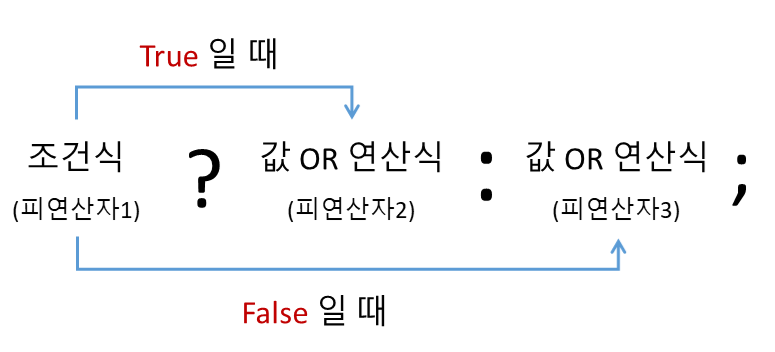

# [JS] 조건(삼항)연산자란?

## 조건(삼항)연산자란?

조건(삼항)연산자는 JavaScript에서 세 개의 피연산자를 받는 유일한 연산자이다. 앞에서부터 조건문, 물음표(?), 조건문이 참(truthy)일 경우 실행할 표현식, 콜론(:), 조건문이 거짓(falsy)일 경우 실행할 표현식이 배치된다. 해당 연산자는 if...else 문의 대체재로 빈번히 사용된다.

false 이외의 falsy한 표현식에는 null, NaN, 0, 비어있는 문자열(""), 그리고 undefined가 있다.

<div align="center" style="margin-bottom: 2rem;">
  
</div>

```javascript
condition ? exprIfTrue : exprIfFalse;
```

- **condition** : 조건문으로 사용되는 표현식
- **exprIfTrue** : condition이 truthy한 값으로 평가될 경우 실행되는 표현식 (true와 같거나, true로 치환될 수 있는 값)
- **exprIfFalse** : condition이 falsy한 값으로 평가될 경우 실행되는 표현식 (false와 같거나, false로 치환될 수 있는 값)

<br>

## 삼항연산자의 예제

```java
// 삼항을 사용한 경우
int b = (5 < 4) ? 50 : 40;
System.out.println(b); //결과 = 40

// 삼항을 사용하지 않은 경우
int a;
if(5<4) {
    a = 50;
}else {
    a = 40;
}
System.out.println(a); //결과 = 40
```

<br>

## ⚡참조

- <https://developer.mozilla.org/ko/docs/Web/JavaScript/Reference/Operators/Conditional_Operator>
- <https://junghn.tistory.com/entry/JAVA-삼항연산자이란-사용법-예제>
