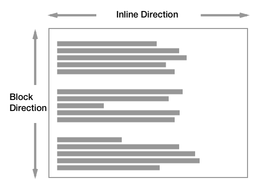
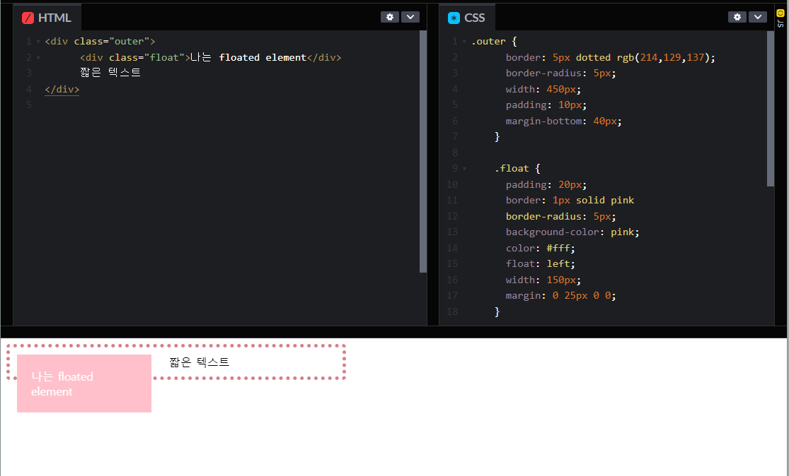
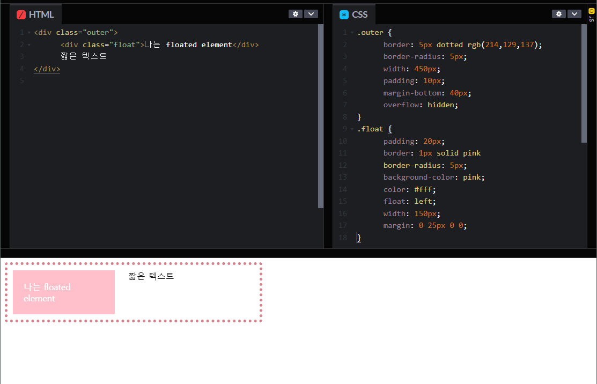
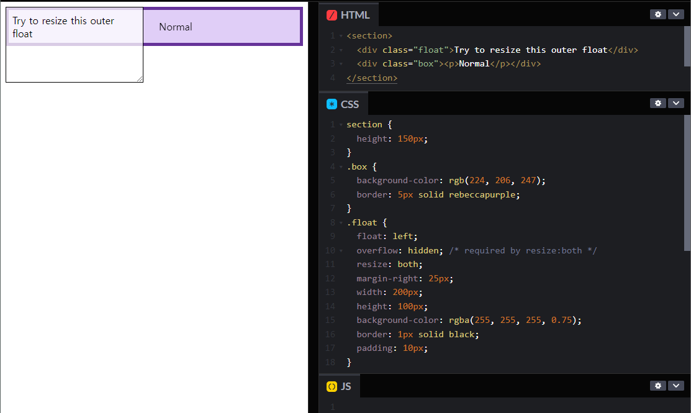
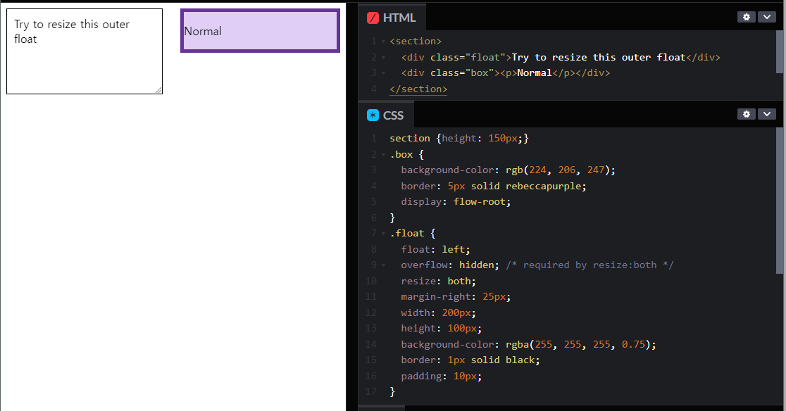
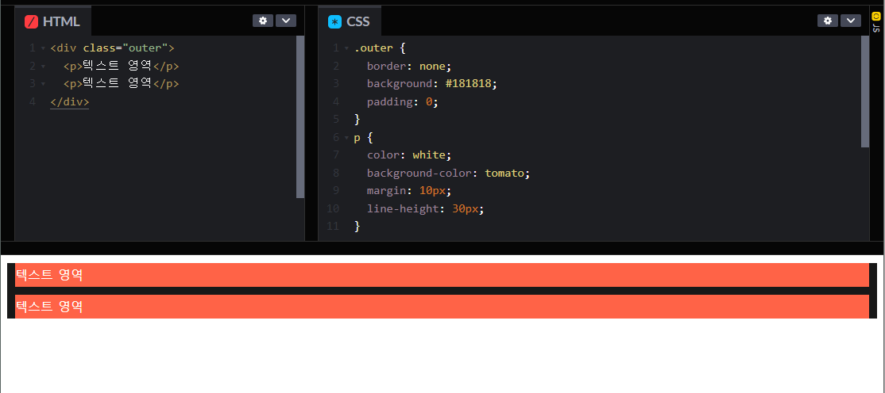
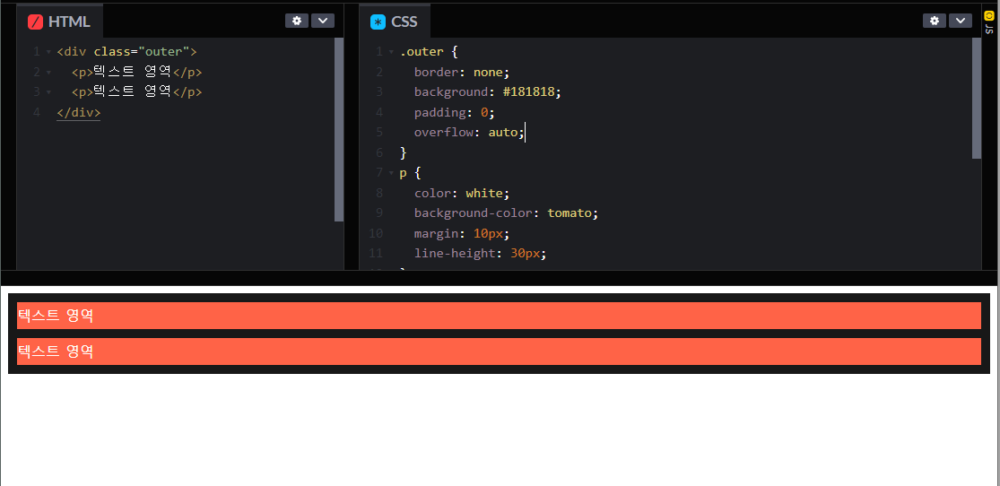
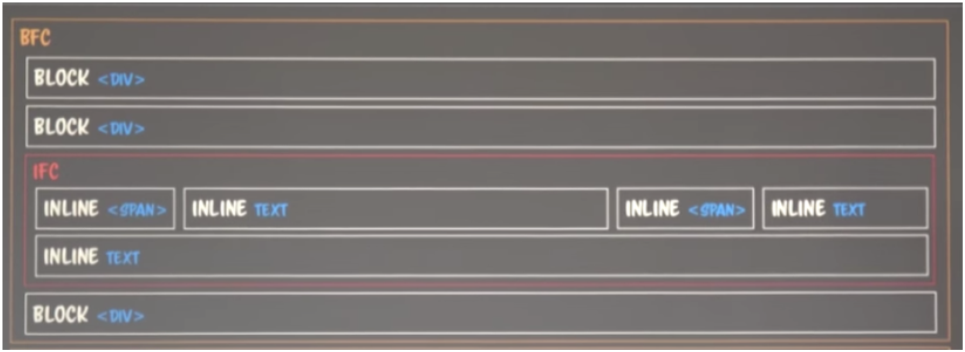

# [CSS] BFC와 IFC

## Normal Flow

"웹페이지의 기본 레이아웃"

만일 요소의 레이아웃을 변경하지 않을 시 웹페이지 요소가 자기 자신을 배치하는 방법이다.

<https://developer.mozilla.org/en-US/docs/Learn/CSS/CSS_layout/Normal_Flow>

  

 

## BFC(Block Formatting Contexts)

블록 서식 맥락(Block Format Context)는 보통 독립된 렌더링 구역이다. 하위 요소들은 컨테이너 밖 요소에 영향을 주지 않고 받지도 않는다. Width값은 부모 요소의 너비 100%이고, height는 content의 최대 높이이다.블록 요소는 마지막 요소 아래 라인에 위치한다. 또한, Margin에 의해서 구분되며, 더 큰 Margin 쪽으로 margin collapsing 된다. BFC를 이용하면 요소 간의 margin 겹침을 해결할 수 있고 float된 요소를 포함할 수 있도록 한다.

### 1. BFC가 생성되기 위해서 필요한 조건

- 최상위 태그가 \<HTML>
- 플로팅 속성을 가질 경우 (float가 none이 아닌 경우)
- 절대 위치를 지정한 경우 (position이 absolute나 fixed인 경우)
- 인라인 블록 (display가 inline-block인 경우)
- 표 칸 (display가 table-cell, HTML 표 칸의 기본값)
- 표 주석 (display가 table-caption, HTML 표 주석의 기본값)
- display가 table, table-row, table-row-group, table-header-group, table-footer-group (HTML 표에서 각각 표 전체, 행, 본문, 헤더, 푸터의 기본값) 또는 inline-table인 요소가 암시적으로 생성한 무명 칸인 경우
- overflow가 visible이 아닌 블록 요소
- display: flow-root인 경우
- contain: layout, content, paint인 경우
- display가 flex, inline-flex, grid, inline-gird..
- Multicol containers
- column-span: all인 경우
- <https://developer.mozilla.org/ko/docs/Web/Guide/CSS/Block_formatting_context>

### 2. BFC의 활용

1. 내부 Float 요소를 부모 컨테이너 안으로 집어 넣고 싶을 때

   - <https://codepen.io/minki607/pen/BazpOKa?editors=1100>

  <figure>
    
    <figcaption>부모 컨테이너가 BFC가 아닌 경우</figcaption>
  </figure>

  <figure>
    
    <figcaption>부모 컨테이너가 BFC가 아닌 경우</figcaption>
  </figure>

2. 외부 Float 요소를 부모 컨테이너 안으로 집어 넣고 싶을 때

   - <https://codepen.io/tmoon79/pen/WNKZyma>

  <figure>
    
    <figcaption>Inline에 있는 다른 객체가 BFC가 아닌 경우</figcaption>
  </figure>

  <figure>
    
    <figcaption>Inline에 있는 다른 객체가 BFC가 아닌 경우</figcaption>
  </figure>

3. Margin 겹치는 현상을 막고 싶을 때

  <figure>
    
    <figcaption>부모 컨테이너가 BFC가 아닌 경우 마진 겹침 현상이 발생한다.</figcaption>
  </figure>

  <figure>
    
    <figcaption>부모 컨테이너가 BFC가 아닌 경우 마진 겹침 현상이 발생한다.</figcaption>
  </figure>

 

## IFC(Inline Formatting Contexts)

IFC의 높이는 내부 요소의 최대 크기로 계산된다.

  

- 콘텐츠의 크기 (width/height)를 따르나, 별도로 설정할 수 없다.
- 다음 IFC는 이전 IFC의 가로 길이만큼 떨어진 자리에 X가 결정된다.
- inline width의 합이 부모의 width를 넘기면 overflow 되는 텍스트 또는 요소는 새로운 줄에 위치한다.
- inline을 구성하는 것 중 가장 height가 큰 것이 lineheight가 되어서 lineheight만큼 y값이 내려온다
- IFC에서 block이 생기면 IFC가 종료되고 다음 블록 요소가 만들어 진다.
- margin은 쓰기 모드의 방향으로만 적용된다.
