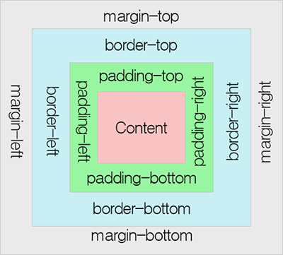
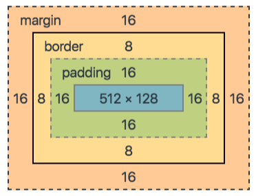
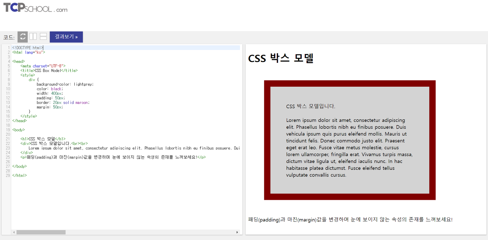

# [CSS] Box Model이란?

## Box Model이란?

모든 HTML 요소는 박스(Box) 모양으로 구성되며, 이것을 박스 모델(Box Model)이라고 부른다.

박스 모델은 HTML 요소를 패딩(padding), 테두리(border), 마진(margin), 그리고 내용(content)으로 구분한다.

  <figure>
    
    <figcaption>Chrome DevTools에서 확인 가능한 Box-Model 사진이다.</figcaption>
  </figure>

  

  

| 명칭           | 설명                                                                                                                                                                                                 |
| -------------- | ---------------------------------------------------------------------------------------------------------------------------------------------------------------------------------------------------- |
| 내용(Content)  | - 요소의 텍스트나 이미지가 들어있는 박스의 실질적인 내용 부분 - width와 height 프로퍼티를 갖는다.                                                                                                 |
| 패딩(Padding)  | - 테두리(Border) 안쪽에 위치하는 요소의 내부 여백 영역이다. - Padding 프로퍼티 값은 패딩 영역의 두께를 의미하며 기본색은 투명하다. - 요소에 적용된 배경의 컬러, 이미지는 패딩 영역에 적용된다. |
| 테두리(Border) | 테두리 영역으로 border 프로퍼티 값은 테두리의 두께를 의미한다.                                                                                                                                       |
| 마진(Margin)   | - 테두리 바깥에 위치하는 요소의 외부 여백 영역 - Margin 프로퍼티 값은 마진 영역의 두께를 의미한다. - 기본적으로 투명하며 배경색을 지정할 수 없다.                                              |

<https://developer.mozilla.org/en-US/docs/Learn/CSS/Building_blocks/The_box_model>

 

## Height와 Width 속성의 이해

Width와 Height 프로퍼티는 요소의 너비와 높이를 지정하기 위해 사용된다.

Box-sizing 프로퍼티에 기본값인 content-box가 적용되면 지정되는 요소의 높이는 콘텐츠 영역을 대상으로 한다.

Box-sizing 프로퍼티에 border-box를 적용하면 콘텐츠 영역, 패딩, 테두리가 포함된 영역을 width/height 프로퍼티의 대상으로 지정할 수 있다.

만약 Width와 Height로 지정한 콘텐츠 영역보다 실제 콘텐츠가 크면 콘텐츠 영역을 넘치게 된다.

이때 ' overflow: hidden;' 을 지정하면 넘친 콘텐츠를 감출 수 있다.

 

## ⚡참조

- <https://poiemaweb.com/css3-box-model>
- <https://www.tcpschool.com/css/css_boxmodel_boxmodel>
