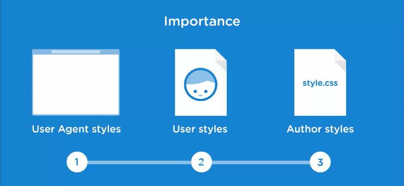
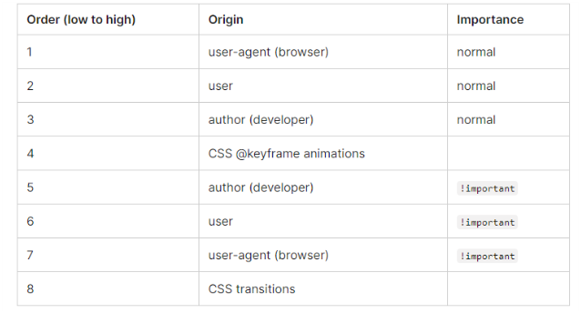
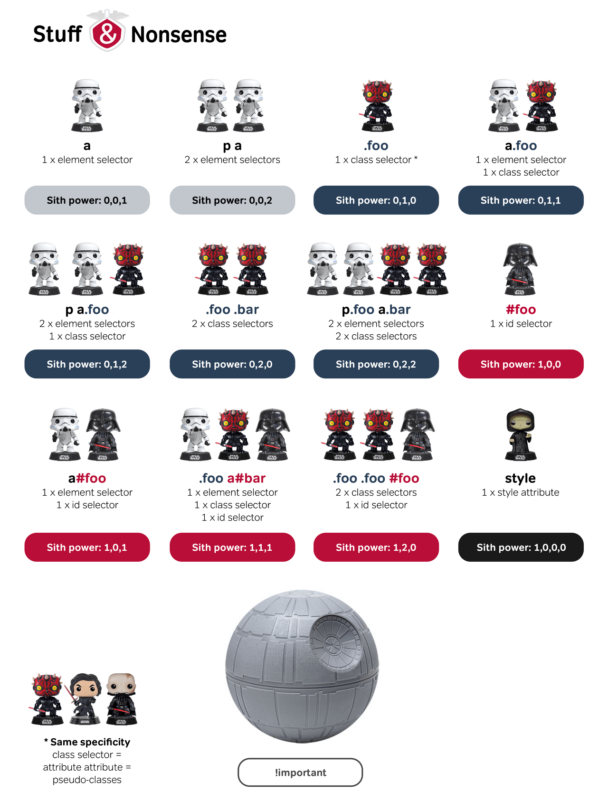

# [CSS] Cascading System이란?

## Cascading System이란?

- "하나의 엘리먼트에 대해서 다양한 효과가 영향력을 행사하려고 할 때 우선순위를 어떻게 설정하는 가에 대한 규칙"
- HTML Element(요소)는 하나 이상의 스타일에 영향을 받을 수 있다. 그 때, 어떤 스타일을 적용받을 지에 대한 우선 순위가 정해져야 하는데 이것을 Cascading이라고 한다.
- [MDN - CSS Cascade](https://developer.mozilla.org/en-US/docs/Web/CSS/Cascade)

<br />

## Origin 사이의 우선 순위

<div align="center" style="margin-bottom: 2rem;">
   <figure>
    
    <figcaption>
      <a href="https://itzone.com.vn/en/article/cascading-in-css-2/" target="_blank" rel="noopener noreferrer">https://itzone.com.vn/en/article/cascading-in-css-2/</a>
    </figcaption>
  </figure>
</div>

<div align="center" style="margin-bottom: 2rem;">
  
</div>

- **User-agent Stylesheets (=Browser Define)**: 브라우저가 기본으로 가지고 있는 스타일
- **User Stylesheets (=User Define)**: 브라우저를 사용하는 사용자가 스타일시트를 지정 (요새 제공 안하는 경우가 많음)
- **Author Stylesheets (=Developer Define)**: 웹 개발자가 사용하는 스타일시트 (우선 순위가 제일 높음)

<br />

## 결정되는 3가지 요인

1. CSS가 어디에 선언되어있나 (중요도)
2. 대상을 명확하게 지정할수록 높은 우선순위를 가지고 있다 (명시도)
3. 코드 순서 (Order of Appearance)

### 1. 중요도 (Author Stylesheets 내의 우선 순위)

1. `<head>`의 `<style>`
2. `<head>`의 `<style>` 내의 `@import`
3. `<link>`로 연결된 css 파일
4. `<link>`로 연결된 css 파일 내의 `@import`
5. 브라우저의 기본 css

즉, `<head>` 요소 내에 있는 `<style>`이 `<link>`로 된 css파일보다 우선순위가 높다.

### 2. 명시도(Specificity 내의 우선 순위)

명시도(Specificity)란 중요도를 계산해서 어느 스타일을 적용할 지를 정한다.

[MDN - Specificity](https://developer.mozilla.org/en-US/docs/Web/CSS/Specificity)

1. `!important`
2. inline 스타일
3. id selector
4. 클래스 / 가상 선택자
5. 태그 선택자
6. 상속된 스타일

> `!important`는 남용하는 것은 좋지 않다.  
> inline은 높은 우선순위를 갖지만, `<style>`이나 외부 css 파일로 빼는 것이 좋다.

#### 명시도(Specificity) 계산법

<div align="center" style="margin-bottom: 3rem;">
   <figure>
    
    <figcaption>
      <a href="https://devopedia.org/images/article/291/6573.1602765746.jpg" target="_blank" rel="noopener noreferrer">https://devopedia.org/images/article/291/6573.1602765746.jpg</a>
    </figcaption>
  </figure>
</div>

👉 [Specificity 계산기](https://specificity.keegan.st/)

### 3. Order of Appearance

동일 선상에 있는 스타일의 경우에는 **가장 늦게 선언된 스타일이 적용된다.**

```css
/* 아래의 경우 Hello는 blue로 나옵니다. */
p {
  color: red;
}
p {
  color: blue;
}

<div>
  <p>Hello</p>
</div>
```

<br />

## ⚡Reference

- [런코딩 블로그 - CSS Cascading](https://runcoding.tistory.com/19)
- [Victory 블로그 - CSS 우선순위](https://victorydntmd.tistory.com/190)
