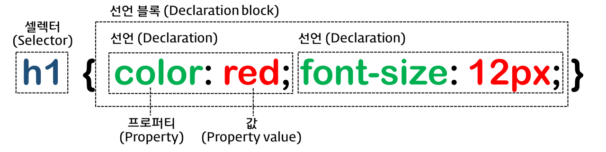

# [CSS] CSS Selector란?

## CSS Selector이란

CSS는 선택자를 잡아 HTML 요소에 스타일을 준다. CSS가 선택자를 잡는 기준을 5가지로 나눌 수 있다.

<https://developer.mozilla.org/ko/docs/Web/CSS/CSS_Selectors>

<div align="center" style="margin-bottom: 2rem;">
   <figure>
    
    <figcaption>
      <a href="https://poiemaweb.com/css3-selector" target="_blank" rel="noopener noreferrer">CSS Rule Set ( https://poiemaweb.com/css3-selector )</a>
    </figcaption>
  </figure>
</div>

1. **Simple Selectors** 기본 선택자 (요소의 name, id, class를 기준으로 선택)
2. **Combinator Selectors** 관계 선택자 (요소 간의 관계를 기준으로 선택)
3. **Pseudo-class Selectors** 가상 선택자 (요소의 특정 상태를 기준으로 선택)
   - "요소(Element)의 특정한 상태값을 지칭하는 것"
   - <https://developer.mozilla.org/en-US/docs/Web/CSS/Pseudo-classes>
4. **Pseudo-elements Selectors** 가상 요소 선택자 (요소의 특정 부분(영역)을 선택)
   - "의사 요소(Element)로서 선택한 요소의 일부분을 특정 짓게 해주는 것"
   - <https://developer.mozilla.org/en-US/docs/Web/CSS/Pseudo-elements>
5. **Attribute Selectors** 속성 선택자 (요소가 가진 속성이나 속성의 값으로 선택)

<br />

## Pseudo-class와 Pseudo-elements

```css
// pseudo-class
selector:pseudo-class {
  // : 콜론 1개
  property: value;
}

// pseudo-element
selector::pseudo-element {
  // :: 콜론 2개
  property: value;
}
```

<https://developer.mozilla.org/en-US/docs/Learn/CSS/Building_blocks/Selectors/Pseudo-classes_and_pseudo-elements>

<br />

## CSS Selector Reference

- <https://www.w3schools.com/css/css_selectors.asp>
- <https://www.w3schools.com/cssref/css_selectors.php>

<br />

## ⚡CSS Selector 더 공부하기 좋은 사이트 추천!!

- <https://androman.tistory.com/48>
- <https://myprivatestudy.tistory.com/54>
- <https://jsikim1.tistory.com/22>
