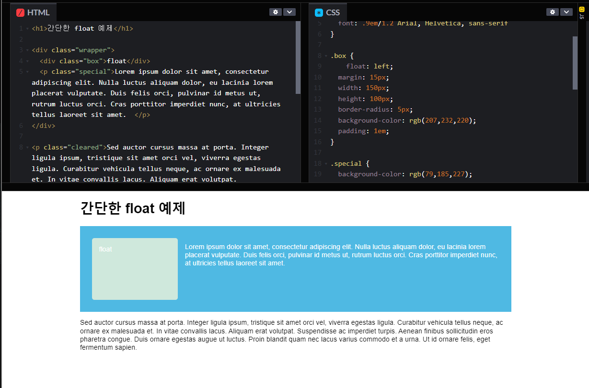

# [CSS] Float와 clear 속성

## Float 속성이란?

Float 속성은 웹 요소를 문서 위에 떠있게 만드는데 홈페이지 레이아웃을 할 때 꼭 알아야 할 속성이다.

<https://developer.mozilla.org/ko/docs/Learn/CSS/CSS_layout/Floats>

1. block의 성격을 무시한다.
2. 형제 구조로 이루어진다. (\<li>와 같은)
3. 해당 요소들의 높이 값이 맞아야 미디어쿼리 적용 시 제대로 동작한다.

### 1. 속성값

- float : left
- float: right
- float : none

### 2. 활용

<div align="center" style="margin-bottom: 2rem;">
   <figure>
    
    <figcaption>
      <a href="https://codepen.io/tmoon79/pen/QWBrKXX" target="_blank" rel="noopener noreferrer">https://codepen.io/tmoon79/pen/QWBrKXX</a>
    </figcaption>
  </figure>
</div>

<br>

## Clear 속성이란?

clear: both는 취소하다라는 개념으로 float: left/right와 같이 쓰이는 개념이다.

float 속성을 적용하면 그 이후에 오는 다른 요소들까지 똑같은 속성이 전달되어 둘러싼 형태가 되거나 부유된 영역 아래(under)로 들어가게 된다.

float 속성을 더 이상 사용하지 않고 싶으면 clear:both; 를 사용한다.

### 1. 속성값

- clear: both; -- 가장 많이 사용한다.
- clear: left;
- clear: right;
- clear: none;

### 2. clear: both; 사용법

부모 태그에 클래스 이름을 floatClear으로 주고 ::after 가상 요소를 이용하는 방법이 있다. 이와 같이 사용하면, float를 줄 때마다 부모 클래스 이름에 floatClear를 넣어주면 css에서 일일이 clear:both를 줄 필요가 없다.

```css
.floatClear:after {
  content: "";
  display: block;
  clear: both;
}
```

<br>

## float 속성을 해지하는 방법

- <https://velog.io/@hsecode/CSS-float-%ED%95%B4%EC%A0%9C%ED%95%98%EA%B8%B0-float-clear>
- <https://naradesign.github.io/float-clearing.html>

<br>

## ⚡참조

- <https://goddino.tistory.com/66>
