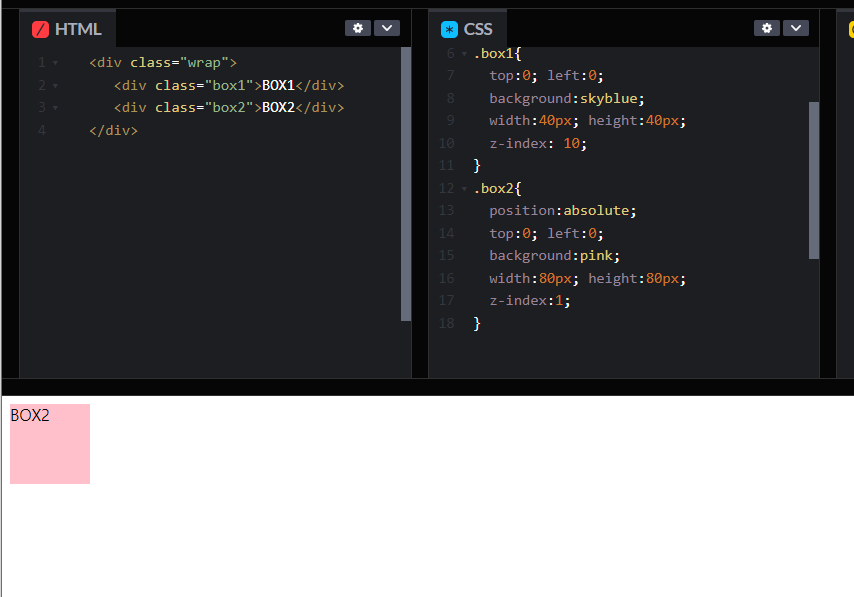
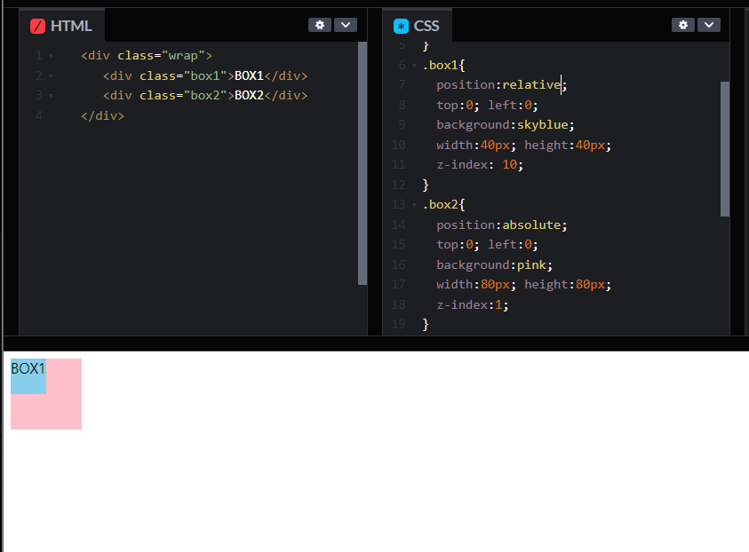
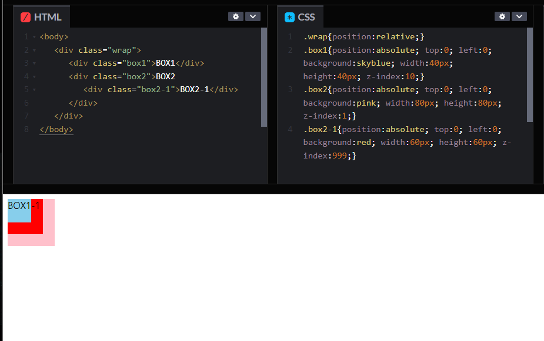
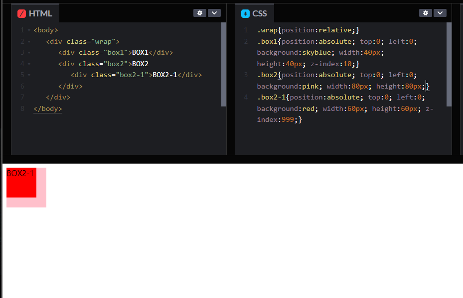
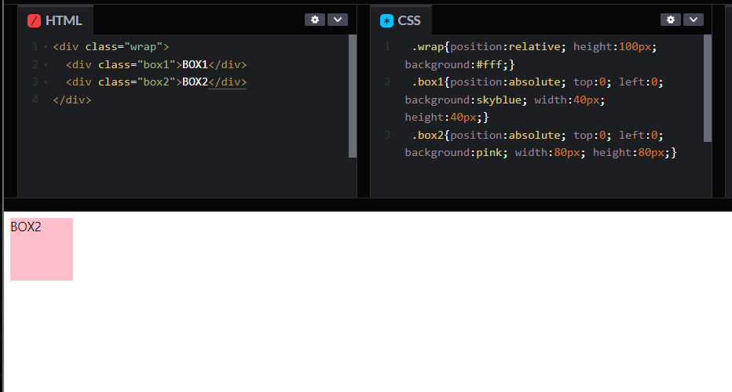
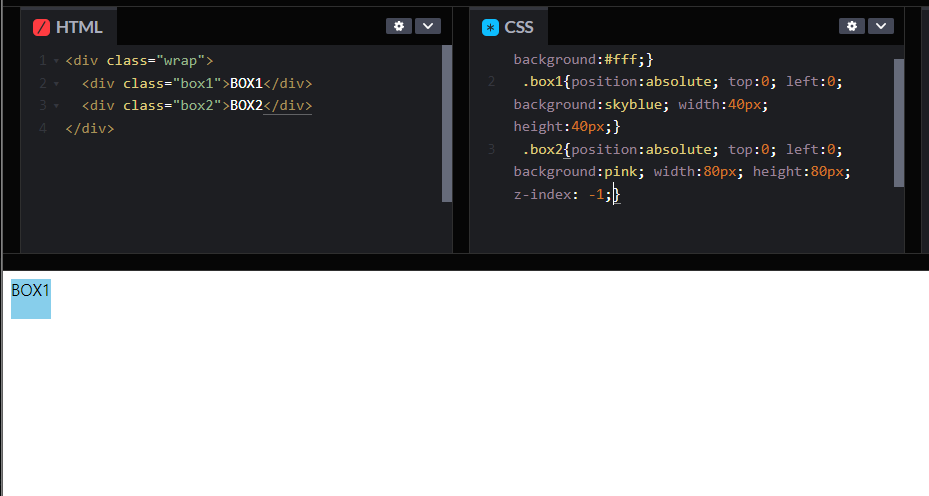

# [CSS] z-index란?

## z-index란?

CSS z-index 속성은 위치 지정 요소와 그 자손 또는 하위 플렉스 아이템의 Z축 순서를 지정한다. 더 큰 z-index 값을 가진 요소가 작은 값의 요소 위를 덮는다.

기본값은 auto이고 일반적으로 -1 1 100 999 등의 숫자로 속성의 값을 지정한다.

<https://developer.mozilla.org/ko/docs/Web/CSS/z-index>

 

## 특징

1. z-index 속성이 적용되기 위해서는 z-index를 적용한 영역이 position:static 값이 아니어야 한다.

   - 첫번째 사진에서 .box1의 z-index 값이 .box2의 z-index 값보다 크기에 .box1가 더 앞쪽에 위치해야 할 것 같지만 .box2가 .box1을 가리고 있다. 이유는 바로 .box1에 position값이 지정되어 있지 않기 때문이다. 두번째 사진을 보면 .box1이 position: relative; 값을 가지면서 .box1이 .box2의 위로 오는 것을 확인할 수 있다!

  

  

2. z-index의 비교 대상은 같은 형제 요소에서 선언되어야 한다.

   - 첫번째 사진을 보면 .box2-1의 z-index값이 999이기에 앞에 위치할 것 같지만 .box1이 가장 위쪽으로 위치한다. 이는 .box1과 .box2 두 형제 요소끼리에서 z-index 비교로 .box2가 .box1에 밀리기 때문이다.
   - 두번째 사진에 .box2-1를 가장 위쪽으로 위치하기 위해 .box2에 설정된 z-index:1;를 제거한다.

  

  

3. z-index의 음수(-) 값

   - 첫번째 사진의 경우 .box2가 .box1을 덮는 것을 볼 수 있다. 이 경우 두번째 사진처럼 .box1의 z-index를 조정하지 않고 .box2에 z-index를 음수로 줘서 조정할 수 있다.

  

  

 

## ⚡참조

- <https://abcdqbbq.tistory.com/m/39>
