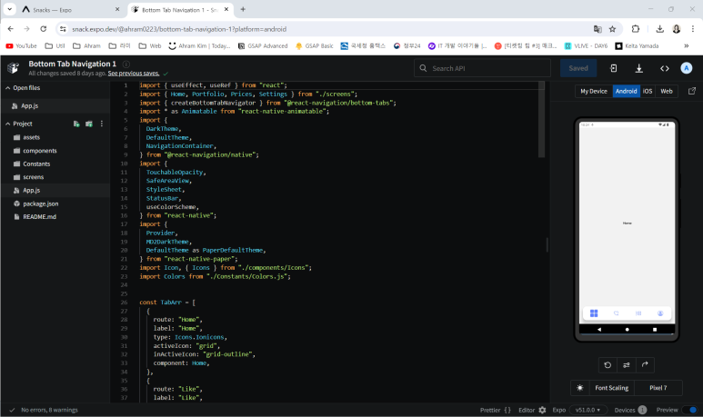

# Bottom Tab Navigation 구현하기 1

- <https://snack.expo.dev/@ahram0223/bottom-tab-navigation-1?platform=android>

<br>

## 탭 내비게이션 리스트

```js
const TabArr = [
  {
    route: "Home",
    label: "Home",
    type: Icons.Ionicons,
    activeIcon: "grid",
    inActiveIcon: "grid-outline",
    component: Home,
  },
  {
    route: "Like",
    label: "Like",
    type: Icons.MaterialCommunityIcons,
    activeIcon: "heart-plus",
    inActiveIcon: "heart-plus-outline",
    component: Portfolio,
  },
  {
    route: "Search",
    label: "Search",
    type: Icons.MaterialCommunityIcons,
    activeIcon: "timeline-plus",
    inActiveIcon: "timeline-plus-outline",
    component: Prices,
  },
  {
    route: "Account",
    label: "Account",
    type: Icons.FontAwesome,
    activeIcon: "user-circle",
    inActiveIcon: "user-circle-o",
    component: Settings,
  },
];
```

<br>

## 애니메이션 Bottom Tab Navigation 만들기

```js
const Tab = createBottomTabNavigator();

const screenOptions = {
  headerShown: false,
  tabBarStyle: {
    height: 60,
    position: "absolute",
    margin: 16,
    borderRadius: 16,
    justifyContent: "center",
    alignItems: "center",
  },
};

const options = {
  tabBarShowLabel: false,
  tabBarButton: (props) => <TabButton {...props} item={item} />,
};

const TabButton = (props) => {
  const { item, onPress, accessibilityState } = props;
  const focused = accessibilityState.selected;
  const viewRef = useRef(null);

  useEffect(() => {
    if (focused) {
      viewRef.current.animate({
        0: { scale: 0.5, rotate: "0deg" },
        1: { scale: 1.5, rotate: "360deg" },
      });
    } else {
      viewRef.current.animate({
        0: { scale: 1.5, rotate: "360deg" },
        1: { scale: 1, rotate: "0deg" },
      });
    }
  }, [focused]);

  return (
    <TouchableOpacity
      onPress={onPress}
      activeOpacity={1}
      style={[styles.container, { top: 0 }]}
    >
      <Animatable.View ref={viewRef} duration={1000}>
        <Icon
          type={item.type}
          name={focused ? item.activeIcon : item.inActiveIcon}
          color={focused ? Colors.primary : Colors.primaryLite}
        />
      </Animatable.View>
    </TouchableOpacity>
  );
};

export default function App() {
  const isDarkMode = useColorScheme() === "dark";

  const backgroundStyle = {
    flex: 1,
    backgroundColor: isDarkMode ? Colors.black : Colors.white,
  };

  return (
    <Provider theme={isDarkMode ? MD2DarkTheme : PaperDefaultTheme}>
      <StatusBar
        barStyle={isDarkMode ? "light-content" : "dark-content"}
        backgroundColor={backgroundStyle.backgroundColor}
      />
      <NavigationContainer theme={isDarkMode ? DarkTheme : DefaultTheme}>
        <SafeAreaView style={{ flex: 1 }}>
          <Tab.Navigator screenOptions={screenOptions}>
            {TabArr.map((item, index) => {
              return (
                <Tab.Screen
                  key={index}
                  name={item.route}
                  component={item.component}
                  options={options}
                />
              );
            })}
          </Tab.Navigator>
        </SafeAreaView>
      </NavigationContainer>
    </Provider>
  );
}

const styles = StyleSheet.create({
  container: {
    flex: 1,
    justifyContent: "center",
    alignItems: "center",
    height: 60,
  },
});
```

<br>

## 완성

<div align="center" style="margin-bottom: 2rem;">
   <figure>
    
    <figcaption>
      <a href="https://snack.expo.dev/@ahram0223/bottom-tab-navigation-1?platform=android" target="_blank" rel="noopener noreferrer">https://snack.expo.dev/@ahram0223/bottom-tab-navigation-1?platform=android</a>
    </figcaption>
  </figure>
</div>
