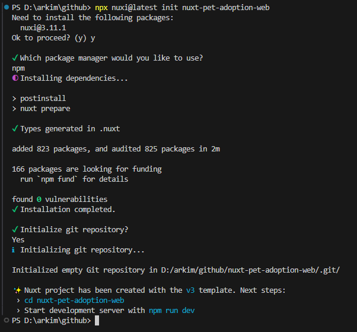
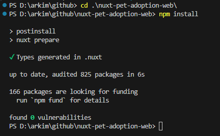
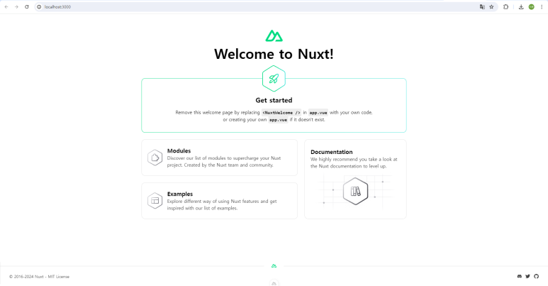
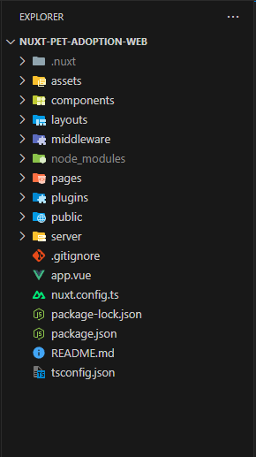

# [nuxt] Nuxt.js 시작하기 및 구조

- <https://nuxt.com/>

<br />

## 목차

- [1. Nuxt.js 설치하기](#1-nuxtjs-설치하기)
- [2. Nuxt 디렉토리 구성](#2-nuxt-디렉토리-구성)

<br />

## 1. Nuxt.js 설치하기

### 1) npx nuxi@latest init \<project-name\>

```sh
$ npx nuxi@latest init <project-name>
```

<div align="center" style="margin-bottom: 2rem;">
  
</div>

### 2) npm install

```sh
$ cd <project-name>
$ npm install
```

<div align="center" style="margin-bottom: 2rem;">
  
</div>

### 3) npm run dev

```sh
$ npm run dev
```

<div align="center" style="margin-bottom: 2rem;">
  
</div>

<br />

## 2. Nuxt 디렉토리 구성

<div align="center" style="margin-bottom: 2rem;">
  
</div>

### Assets 디렉토리

- LESS, SASS, JavaScript 같은 컴파일되지 않은 에셋들을 포함하는 디렉토리
- script로 움직이는 로직과는 독립적으로 사진파일 또는 디자인 적으로 보여지기 위한 파일들

### Components 디렉토리

- Vue.js 컴포넌트를 포함하는 디렉토리
- 페이지들에 사용되는 커스텀 컴포넌트 모듈들을 가진다.
- Nuxt.js는 이러한 컴포넌트에 데이터 메소드를 크게 신경쓰지 않는다.
- 컴포넌트는 재귀적으로도 사용 될 수 있으며 코드의 재사용성을 높이고 유지보수를 용이하게 한다.

### Layouts 디렉토리

- 애플리케이션의 레이아웃을 포함하는 디렉토리

### Middleware 디렉토리

- 애플리케이션의 미들웨어를 포함하는 디렉토리. 미들웨어는 페이지나 레이아웃이 렌더링되기 전에 실행할 사용자 정의 함수를 정의할 수 있다.

### Pages 디렉토리

- 애플리케이션의 뷰와 라우트를 포함하는 디렉토리
- Nuxt.js는 모든 .vue 파일을 읽고 애플리케이션의 라우터를 생성한다.
- .vue 확장자의 모든 파일은 뷰페이지로 컴파일 되며 라우팅 규칙에서 index.vue로 된 파일명은 생략이 가능하다.

### Plugins 디렉토리

- 루트 vue.js 애플리케이션이 생성되기 전 실행하고 싶은 자바스크립트 플러그인을 포함하는 디렉토리

### Static 디렉토리

- robots.txt 또는 favicon.ico 같은 정적 파일들을 포함하는 디렉토리
- 이 디렉토리 파일들은 /에 연결된다.
  - 예) /static/robots.txt는 /robots.txt로 연결된다

### Store 디렉토리

- Vuex Store 파일을 포함하는 디렉토리
- Vuex Store 옵션은 Nuxt.js 프레임워크에 의해 실행되며, index.js 파일을 생성하면 프레임워크가 자동으로 옵션을 활성화한다.

### nuxt.config.js 파일

- Nuxt.js의 사용자 정의 설정을 포함하는 파일

### package.json 파일

- 애플리케이션의 의존성과 스크립트를 포함하는 파일

### vue 템플릿 내에서 assets이나 static 디렉토리에 링크할 필요가 있다면 ~assets/image.png, ~static/image.png 처럼 입력해야 한다
