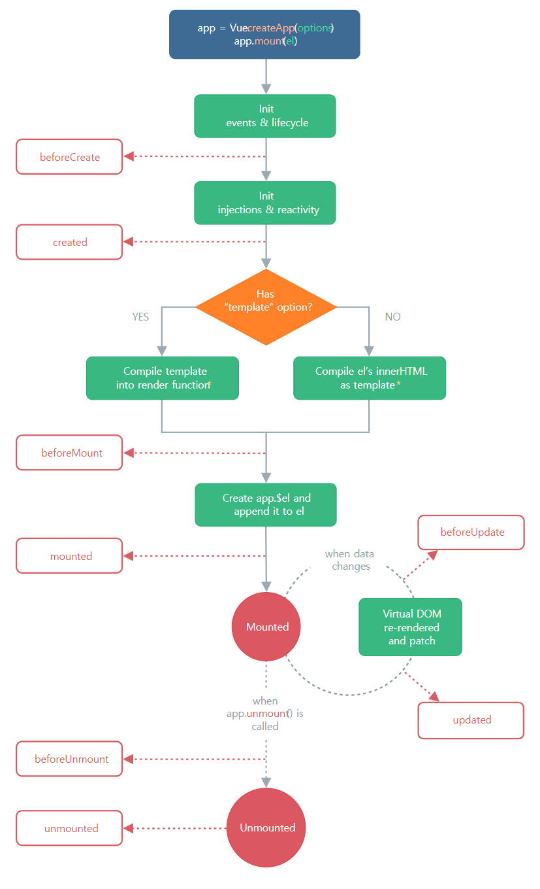

# [vue] LifeCycle

<div align="center" style="margin-bottom: 2rem;">
  
</div>

- 인스턴스 : 객체지향 프로그래밍에서 Class에 소속된 개별적인 객체를 말한다.
  - User라는 클래스를 정의하고 Hong이라는 객체를 생성할 경우 Hong이라는 객체는 User라는 클래스의 인스턴스가 된다.
- 하나의 클래스를 사용하여 유사한 성질을 가진 수많은 인스턴스를 생성할 수 있다.
- Vue.js가 가지고 있는 / 내장되어 있는 함수를 활용할 수 있는 수많은 컴포넌트를 생성해서 이것을 활용할 수 있다.

<br />

## 컴포넌트 생성

각각의 Vue 컴포넌트 인스턴스는 생성될 때, 일련의 초기화 과정을 거친다.

컴포넌트가 생성되고 소멸되기까지의 단계를 말하며, 각 단계에서 실행되는 함수들을 라이프사이클 훅이라 부른다.

세 가지 훅(Hook)이 가장 많이 사용되는데

### 1. Created

- 컴포넌트가 생성된 직후에 접근할 수 있는 라이프사이클 훅이다.
- 템플릿 및 Virtual DOM이 마운팅 혹은 렌더링 되기 전에 실행되며, 데이터와 이벤트가 활성화되어 접근할 수 있다.
- data와 methods에 선언된 변수와 함수에 접근할 수 있다.
- beforeCreate 라이프사이클 훅에선 컴포넌트가 생성되기 전에 동작하는 기능이기 때문에 data, methods에 선언한 데이터, 함수에 접근할 수 없다.

```javascript
<script>
export default {
    data() {
        return {
            count: 0;
        }
    },
    beforeCreate() {
        console.log('LifeCycle is beforeCreate', this.count)
        // LifeCycle is beforeCreate undefined
    },
    created() {
        console.log('LifeCycle is created', this.count)
        // LifeCycle is created 0

        this.test()
        // 함수 호출!!
    },
    methods: {
        test() {
            console.log('함수 호출!!');
        }
    }
}
</script>
```

### 2. Mounted

- 컴포넌트가 초기 렌더링 및 DOM 노드 생성이 완료된 후, 코드를 실행하는 데 사용할 수 있다.
- SFC 구조에서 템플릿 부분이 그려진 후에 코드를 실행하는 데 사용한다.
- 화면 요소를 제어하는 로직을 수행하기에 굉장히 좋은 단계이다.
- 즉, User Interface를 컨트롤하는 부분이라고 이해할 수 있다.

```javascript
<template>
    <h1>Vue.js 라이프사이클 테스트</h1>
</template>
<script>
export default {
    data() {
        return {
            count: 0;
        }
    },
    beforeMount() {
        console.log('LifeCycle is beforeMount', document.querySelector('h1'))
        // LifeCycle is beforeMount null
    },
    mounted() {
        console.log('LifeCycle is mounted', document.querySelector('h1'))
        // LifeCycle is mounted <h1>Vue.js 라이프사이클 테스트</h1>
    },
}
</script>
```

### 3. Updated

- 컴포넌트 데이터가 변경되어 DOM이 렌더링된 후 실행된다.
- 또한, Property가 변경된 후 DOM에 접근해야할 때 사용한다.
